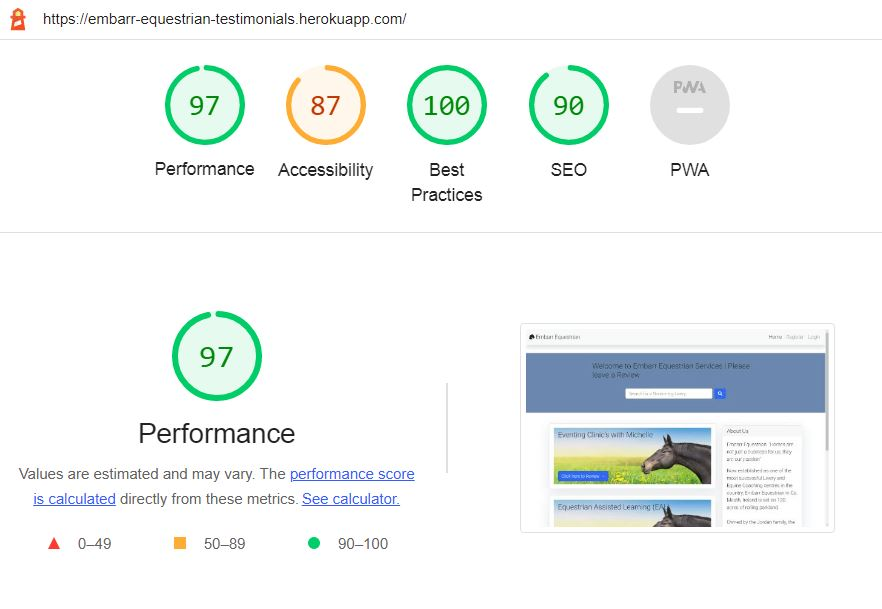

# Embarr Equestrian Testimonials

## Overview

[Embarr Equestrian Testimonials](https://embarr-equestrian-testimonials.herokuapp.com/) is a service review site for an Equine Business (Embarr Equestian) that allows clients to post reviews of services specified on the site. This project is a Full Stack website built using the Django framework and deployed using Heroku. It follows the CRUD logic, Users can Create (Sumbit a Review), Retrieve (Search for a Service), Update (Update their Reviews/ Profile) and Delete (Delete their reviews).

## The Site Mockup

## User Experience

Goals:

* To attract new customers, 
* Highlight the benefits of what the business has to offer, 
* Provide service information,
* Provide a great user experience on all mobile devices,
* Be easy to navigate
* Give clear calls to action
* Build the brand image
* Raise the conversion rate.

As a website user, I can:

1. Navigate around the site and easily view the desired content.
2. View a list of Services.
3. Search for services via the search bar tool.
4. Click on a service post to read more.
5. View the number of reviews posted on a service.
6. Register as an account user.

As logged in website user, I can:

1. Log in as a user.
2. Submit a review of a service.
3. Edit/Delete my previous reviews.
4. Manage my profile by updating my details.
5. Logout from the website.

As a website superuser, I can:

1. Create and publish a new Service Post.
2. Create draft service posts that can be reviewed and published at a later date.
3. Create a new user.
4. Delete user and reviews.
5. Approve user's reviews.

## Agile Methodology

This project was managed using the Agile method. All user stories were captured and updated using Githubs Project functionality and can be reviewed [here](https://github.com/users/chellej80/projects/7).
A list of the issues captured and progressed can be viewed [here](https://github.com/chellej80/Embarr-Equestrian-Testimonials/issues). 

## Flowchart/ Wireframe

## Database Entity Diagram

## Features 

- __Navigation Bar__

  Featured on all pages, the full responsive navigation bar includes links to the Home page and all sub pages - Login, Logout, Register, User Profile link and is identical in structure for each page to allow for easy navigation. When the user logs in, the username appears in lieu of the login option and this links to the user profile page, the register link is also replaced with the logout link. The navigation items are styled to transition to a hamburger menu when the site is reduced in size on a mobile device. This section will allow the user to easily navigate from page to page across all devices without having to revert back to the previous page via the ‘back’ button. 

    

    

- __Logo__

    The logo I created simply using a combination of text and a font awsome icon. The logo is a hyperlink that takes the user to the homepage.
    
    

- __Register Page__

    The User register page was created using the out of the box option from Django Auth. Further styling of this page is required but currently out of scope for the timeframe of this project.

- __Login Page__

    The User login page was created using the out of the box option from Django Auth. Further styling of this page is required but currently out of scope for the timeframe of this project.

- __Logout Page__

  The User logout page was created using the out of the box option from Django Auth. Further styling of this page is required but currently out of scope for the timeframe of this project.

- __Profile Page__

  The User pofile page can be accessed by clicking on the users name in the navigation bar, once they are logged in. the user can update their personal details here. There is room to expand the functionality of this page, for example, allow the user to upload a profile picture or add a bio section, but this was out of scope for this project. Further styling of this page is required but currently out of scope for the timeframe of this project.

- __Search Bar__

    The search bar allows a user to search for a service they would like to read about and leave a review. The search is crude and requires some futher development, but this was out of scope for this project.

    

- __Service Post Pages__

  The service post pages (the homepage), this page lists a high level view of the services offered by Embarr Equestrian. The user can click on the service post to see more detail, or click though the page navigation to see further service posts. These pages also display the 'About me' sidebar, the searchbar option and the navigation bar.

- __Sidebar About Page__

  The sidebar contains the 'About us' details and links to further information that expands on the meaning of Embarr.

- __Service Post Detail Pages__

  The service post detail page(s) are accessed by clicking on the high level view of a service post. This takes the user to a full page view of the service, that expands on the details, allows the user to read the reviews posted, or if logged in submit a review, or delete/ update a review.

- __Submit Review__

  The submit review option is accessed via the service post detail page and is only available for logged in registered users, otherwise this option is hidden. 

- __Update/ Delete Review__

  The Update/delete review option is accessed via the service post detail page and is only available for logged in registered users, otherwise this option is hidden.

### Features Left to Implement

- Contact Page
- Service Categories
- Improved search functionality
- Add bio/ profile picture to profile
- Image gallery that users can upload to

    

## Frameworks & Languages Used
- HTML
- CSS
- JavaScript
- Django
- Python

Python Packages:

- Gunicorn - As the server for Heroku
- Cloudinary - Was used to host the static files and media
- Dj_database_url - To parse the database URL from the environment variables in Heroku
- Psycopg2 - As an adaptor for Python and PostgreSQL databases
- Summernote- As a text editor
- Allauth - For authentication, registration, account management
- Crispy Forms -To style the forms

## Frameworks, Libaries and technologies used

- [Git/ Github](https://github.com/) - Git/Github was used for version control, storage and deployment of the project.
- [Heroku](https://www.heroku.com/) - Heroku was used to deploy and create the terminal application.
- [Am I Responsive](https://amiresponsive.co.uk/ ) - This was used for the mockup image in the overview and assist with the       responsiveness testing.
- [Bootstrap](https://getbootstrap.com/) - This was used to style the website, add responsiveness and interactivity
- [PostgreSQL](https://www.postgresql.org/) - Database used through heroku.
- [Lucidchart](https://lucid.app/) - Lucidchart was used to create the database diagram
- [PEP8](http://pep8online.com/) - PEP8 was used to validate all the Python code
- [W3C - HTML](https://validator.w3.org/) - W3C- HTML was used to validate all the HTML code
- [W3C - CSS](https://jigsaw.w3.org/css-validator/) - W3C - CSS was used to validate the CSS code
- [Fontawesome](https://fontawesome.com/) - To add icons to the website
- [Google Chrome Dev Tools](https://developer.chrome.com/docs/devtools/) - To check App responsiveness and debugging

## Testing Conducted 

### Usability testing 

### Bugs

### Content 

I reviewed all content on the site for:
- Grammar and spelling mistakes
- Hangman pictures are placed properly with proper sizes & displaying as expected
- Instructions are clear and contain correct information
- Verified all text/ headings are displaying correctly

### Validation

- I ran all the Python Code through [PEP8](http://pep8online.com/)
- I ran HTML through [HTML Validator](https://validator.w3.org/)
- I ran the CSS through [Jigsaw](Jigsawhttps://jigsaw.w3.org)
- I also ran all code through [code beautifier](https://codebeautify.org/)

## Lighthouse

Lighthouse was used to test Performance, Best Practices, Accessibility and SEO on Desktop. 
Accessibility - Further work is required here to improve that score.

## Credits

Python Code inspired and adapted from the following tutorials and sources:

- https://inventwithpython.com/invent4thed/chapter8.html

- https://www.w3schools.com/python/default.asp

- https://www.youtube.com/watch?v=pFvSb7cb_Us

- https://note.nkmk.me/en/python-textwrap-wrap-fill-shorten/

- https://www.sololearn.com/Discuss/1582033/how-to-check-if-input-is-empty-in-python

- https://legionscript.medium.com/

- https://getbootstrap.com/docs/4.0/components/modal/

- https://dev.to/earthcomfy/getting-started-custom-user-model-5hc

- https://djangocentral.com/

- https://www.geeksforgeeks.org/django-crud-create-retrieve-update-delete-function-based-views/

- Code Institute - I think therefore I Blog 

### Content

All content was written by the project owner.

### Readme 

- I used the 
[Markdown cheat sheet](https://github.com/tchapi/markdown-cheatsheet/blob/master/README.md) and the [love running template ](https://github.com/Code-Institute-Solutions/readme-template )to help put together my readme.

### Acknowledgments

# Deployment

The site was first developed in Github (Repository created using the Code Institute Template) and tested there locally before deploying to Heroku:

The steps to deploy are as follows: 

- Log in to Heroku or create an account
- On the main page click the button labelled New in the top right corner and from the drop-down menu select Create New App
- You must enter a unique app name
- Next select your region
- Click on the Create App button
- Add Database to App Resources,  Resources Located in the Resources Tab, Add-ons, search and add ‘Heroku Postgres’
 
- The next page is the project’s Deploy Tab. Click on the Settings Tab and scroll down to Config Vars
- Click Reveal Config Vars and enter port into the Key box and 8000 into the Value box and click the Add button
- Copy DATABASE_URL value,  Located in the Settings, click reveal Config Vars, Copy Text in
- Add Secret Key to Config Vars 
- Go to the top of the page and choose the Deploy tab
- Select Github as the deployment method
- Confirm you want to connect to GitHub
- Search for the repository name and click the connect button
- Scroll to the bottom of the deploy page and select the preferred deployment type
- Click either Enable Automatic Deploys for automatic deployment when you push updates to Github

  - On submission the project is forked in Github, by forking the project a copy of the original repository is made that can be viewed without affecting the original repository by following these steps: In the GitHub repository, locate the settings, above this is the option to 'fork', select this to create a copy

  - Cloning a repository: When you create a repository on GitHub.com, it exists as a remote repository. You can clone your repository to create a local copy on your computer and sync between the two locations. It makes it easier to fix merge conflicts, add or remove files, and push larger commits. 

## The Deployed Site 

The live link can be found here - https://embarr-equestrian-testimonials.herokuapp.com/ 